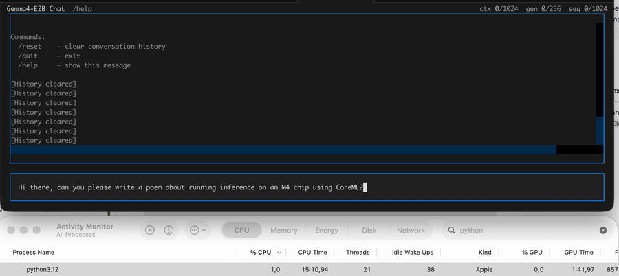

# Gemma4 inference using Apple CoreML



Run **Google Gemma 4 E2B** locally on **Apple Silicon** via **CoreML**.

This project re-implements the Gemma 4 transformer in **JAX/Flax**, exports it to a CoreML `.mlpackage` through **StableHLO**, and provides a **terminal chat UI** for interactive inference — no cloud APIs, everything runs on-device.

## Quickstart

```bash
# 1. Install dependencies
uv sync

# 2. Export the model to CoreML (one-time, ~10-30 min)
uv run gemma-export

# 3. Chat!
uv run gemma-chat
```

> **Prerequisites:** macOS on Apple Silicon and access to `google/gemma-4-E2B-it` on [Hugging Face](https://huggingface.co/google/gemma-4-E2B-it) (accept the model license first).

## How it works

**Step 1 — Export** (`gemma-export`, run once):

`weight_mapper.py` downloads the HF checkpoint, `model.py` defines the full transformer in JAX/Flax, and `export.py` traces it via `jax.jit` → StableHLO → CoreML MIL, producing a single multifunction `.mlpackage` with both **chunked prefill** and **KV-cached decode** functions.

**Step 2 — Chat** (`gemma-chat`):

Loads the `.mlpackage`, runs autoregressive inference with KV caching, and provides a Textual-based terminal UI with streaming tokens, conversation history, and token counts.

## Usage details

**Export options:**

```bash
uv run gemma-export                            # int8 weights → gemma4-e2b.mlpackage
```

**Chat options:**

```bash
uv run gemma-chat                             # uses gemma4-e2b.mlpackage (default)
uv run gemma-chat --compute-units cpu-only   # faster first-load compilation for iteration
uv run gemma-chat --model path/to/other.mlpackage
uv run gemma-chat --backend jax               # use JAX/Flax weights directly (for comparison)
```

In the TUI: `/quit` or `/exit` to leave, `/reset` to clear history, `/help` for commands.

**Compute units:**

By default, `uv run gemma-chat` uses `--compute-units all`, which targets CPU, GPU, and ANE for the best runtime performance. First-load compilation is much slower in that mode (~10–30 min).

For faster development iteration, use `--compute-units cpu-only`:

```bash
uv run gemma-chat --compute-units cpu-only
```

That usually compiles in seconds, but inference is slower than `all`.

**Diagnostics:**

```bash
# A/B: full model vs KV decode (greedy)
uv run gemma-compare-inference --prompt "Hi"

# JAX vs CoreML logit parity after prefill
uv run gemma-parity-decode --max-tokens 8
```

## iOS app

An iOS SwiftUI chat app lives in `ios/GemmaChat/`. It uses the same exported `.mlpackage` for on-device inference.

**First build:** The Xcode build phase automatically downloads `tokenizer.json` (~31 MB) from HuggingFace if it isn't already present. This requires network access once; subsequent builds are offline.

## License

This code is released under the [MIT License](LICENSE).

The **Gemma model weights** are subject to [Google Gemma Terms of Use](https://ai.google.dev/gemma/terms). You must accept the model license on the Hugging Face Hub before downloading weights.
