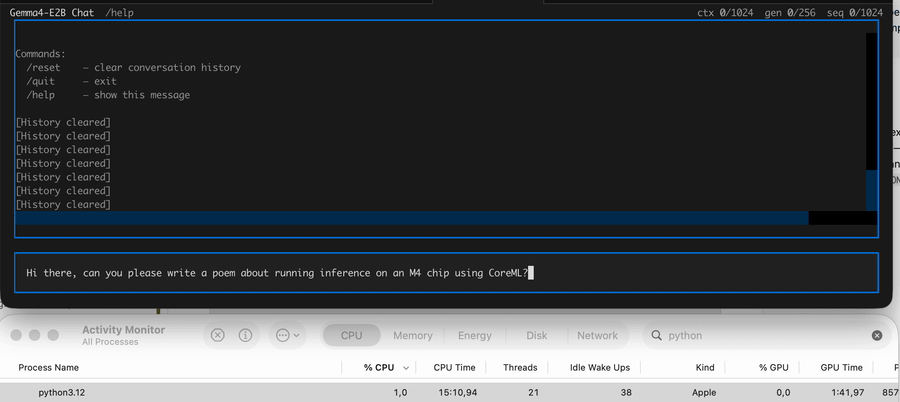

# Gemma 4 inference using Apple CoreML



Run **Google Gemma 4 E2B** locally on **Apple Silicon** via **CoreML**.

This project re-implements the Gemma 4 transformer in **JAX/Flax**, exports it to a CoreML `.mlpackage` through **StableHLO**, and provides both a **Swift CLI chat** and an **iOS app** for interactive inference — no cloud APIs, everything runs on-device.

## Prerequisites

- **macOS on Apple Silicon** (M1 or newer)
- **Xcode 16+** with the Command Line Tools installed (provides `swift` and `xcodebuild`)
- **Python 3.12+** with [`uv`](https://github.com/astral-sh/uv) installed
- For the iOS app: a device running **iOS 18+**
- A Hugging Face account with access to [`google/gemma-4-E2B-it`](https://huggingface.co/google/gemma-4-E2B-it) — accept the model license before first export, then `huggingface-cli login` (or set `HF_TOKEN`)

## Quickstart

```bash
# 1. Install Python dependencies (export only)
uv sync

# 2. Export the model to CoreML (one-time, ~10-30 min, ~8 GB disk)
uv run gemma-export
# (--no-materialize emits a dynamic-shape export that no longer loads — see below)

# 3. Build and run the Swift CLI chat
cd cli && swift build -c release
.build/release/GemmaChatCLI --model ../gemma4-e2b.mlpackage
```

The first CLI launch compiles `.mlpackage` → `.mlmodelc` next to the source (cached for subsequent runs).

## Architecture

### Phase 1 — Export (Python, run once)

`uv run gemma-export` downloads HF weights, defines the full transformer in JAX/Flax, and traces it via `jax.jit` → StableHLO → CoreML MIL, producing a single multifunction `.mlpackage` with both **chunked prefill** and **KV-cached decode** functions (and the embedded tokenizer).

**Materialized by default (`--materialize`).** The exporter materializes the global KV caches into one concrete-shape function pair per cache size (powers of 2 up to `--max-seq-len`), sharing deduplicated weights across functions. This is the default because the **ANE and CPU** CoreML backends have runtime issues with dynamic (`RangeDim`) shapes — they either fail to load or fall back silently to GPU.

`--no-materialize` still emits a single dynamic-shape function pair, but that artifact **no longer loads on any backend**: a `RangeDim` program that also declares CoreML states fails with E5RT/BNNS errors. It is useful only for inspecting the converted program.

**KV caches: half state, half I/O.** Of the 15 cache slots, the 12 sliding-window ones are exported as CoreML **state** — the model owns those buffers and updates them in place, so they never cross the model boundary and the Swift runtime never copies them. The 3 global caches stay ordinary inputs/outputs because their dim 1 is symbolic (states must be static-shaped), and so does the int32 `sliding_pos_ring` (states must be floating point). The sliding writes are built from a whole-tensor `jnp.where` rather than `dynamic_update_slice`: on macOS 26 a state update fed by `slice_update` is applied to a freshly zeroed buffer instead of the live one, while a `select`-shaped update persists correctly.

> **Re-export required.** The Swift runtime expects those state features. Loading a `.mlpackage` exported before this change fails with *"this model predates stateful KV caches"* — re-run `uv run gemma-export`.

### Phase 2 — Inference (Swift)

All inference runs through native Swift for ~20x faster model loading vs Python coremltools:

- **`GemmaCore/`** — Shared SPM library: model loading (`CoreMLModel`), KV cache (`KVCacheState` — global caches plus the shared `MLState` holding the sliding caches), tokenization (`GemmaTokenizer`), sampling, and the inference engine (`InferenceEngine`). One `MLState` is made per conversation via `CoreMLModel.makeState()` and passed to every function of the package, so switching between `decode_512`, `prefill_1024`, … mid-conversation keeps the same sliding caches.
- **`cli/`** — Readline-based Swift CLI chat with streaming output.
- **`ios/GemmaChat/`** — SwiftUI chat app. Uses eager prefill (prefills prompt chunks as the user types) for a snappy first token.

## Running the Swift CLI chat

```bash
cd cli
swift build -c release
.build/release/GemmaChatCLI --model ../gemma4-e2b.mlpackage
```

### CLI flags

| Flag | Default | Description |
|---|---|---|
| `--model <path>` | `./gemma4-e2b.mlpackage` | Path to a `.mlpackage` or pre-compiled `.mlmodelc` |
| `--compute-units <units>` | `cpu-and-gpu` | `all` (includes ANE, slow first compile), `cpu-only`, `cpu-and-gpu`, `cpu-and-ne` |
| `--verbose` | off | Show diagnostic logs on stderr |
| `--log-file <path>` | — | Redirect diagnostic logs to a file |

### CLI chat commands

- `/reset` — clear conversation history and KV cache
- `/quit` — exit
- `/help` — list commands

## Running the iOS chat app

The iOS app lives in `ios/GemmaChat/` and uses `GemmaCore` as a local SPM dependency. The exported `gemma4-e2b.mlpackage` at the repo root is bundled into the app automatically (see `ios/GemmaChat/project.yml`).

1. Make sure `gemma4-e2b.mlpackage` exists at the repo root (run `uv run gemma-export` first if it doesn't).
2. Open `ios/GemmaChat/GemmaChat.xcodeproj` in Xcode.
3. Select a signing team under **Signing & Capabilities** (required for on-device runs).
4. Pick a physical iPhone/iPad destination and **Run**. The simulator does not have enough memory for Gemma 4 E2B.

On first build, Xcode downloads `tokenizer.json` (~31 MB) from Hugging Face via the `Download Tokenizer` build phase.

To regenerate the `.xcodeproj` after editing `project.yml`, install [XcodeGen](https://github.com/yonaskolb/XcodeGen) (`brew install xcodegen`) and run `cd ios/GemmaChat && xcodegen`.

> **Note:** the app loads a ~4 GB model into memory — we recommend a device with 8 GB+ RAM (iPhone 15 Pro or newer).

## Project structure

```
GemmaCore/      Swift Package — shared inference library (model, KV cache, tokenizer, engine)
cli/            Swift CLI chat app
ios/GemmaChat/  iOS SwiftUI chat app
gemma_chat/     Python export pipeline (JAX → StableHLO → CoreML)
tests/          Python tests for MIL passes, stateful KV export, and multifunction export
benchmarks/     Standalone Swift benchmark for model loading / first prediction
```

## Troubleshooting

- **`Error: model not found`** — pass `--model <path>` or run from the repo root where `gemma4-e2b.mlpackage` lives.
- **Tokenizer errors** — re-run `uv run gemma-export`; it embeds the tokenizer inside the `.mlpackage` (the CLI falls back to downloading from Hugging Face if missing).
- **`this model predates stateful KV caches`** — the `.mlpackage` was exported before the sliding KV caches became CoreML state. Re-run `uv run gemma-export`.
- **Slow first load with `--compute-units all`** — ANE compilation can take 10–30 minutes, but is cached in `.mlmodelc` for subsequent runs.

## License

This code is released under the [MIT License](LICENSE).

The **Gemma model weights** are subject to [Google Gemma Terms of Use](https://ai.google.dev/gemma/terms). You must accept the model license on the Hugging Face Hub before downloading weights.
