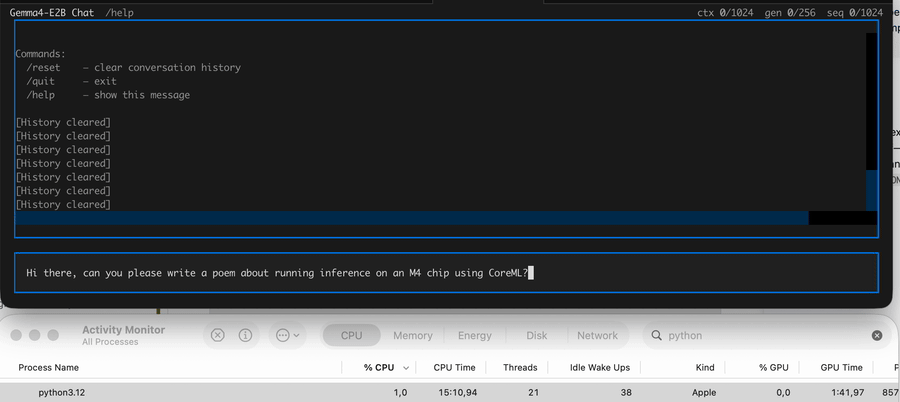

# Gemma 4 inference using Apple CoreML



Run **Google Gemma 4 E2B** locally on **Apple Silicon** via **CoreML**.

This project re-implements the Gemma 4 transformer in **JAX/Flax**, exports it to a CoreML `.mlpackage` through **StableHLO**, and provides both a **Swift CLI chat** and an **iOS app** for interactive inference — no cloud APIs, everything runs on-device.

## Prerequisites

- **macOS on Apple Silicon** (M1 or newer)
- **Xcode 16+** with the Command Line Tools installed (provides `swift` and `xcodebuild`)
- **Python 3.12+** with [`uv`](https://github.com/astral-sh/uv) installed
- For the iOS app: a device running **iOS 18+**
- A Hugging Face account with access to [`google/gemma-4-E2B-it`](https://huggingface.co/google/gemma-4-E2B-it) — accept the model license before first export, then `huggingface-cli login` (or set `HF_TOKEN`)

## Quickstart

```bash
# 1. Install Python dependencies (export only)
uv sync

# 2. Export the model to CoreML (one-time, ~10-30 min, ~8 GB disk)
uv run gemma-export
# (--no-materialize emits a dynamic-shape export that no longer loads — see below)

# 3. Build and run the Swift CLI chat
cd cli && swift build -c release
.build/release/GemmaChatCLI --model ../gemma4-e2b.mlpackage
```

The first CLI launch compiles `.mlpackage` → `.mlmodelc` next to the source (cached for subsequent runs).

## Architecture

### Phase 1 — Export (Python, run once)

`uv run gemma-export` downloads HF weights, defines the full transformer in JAX/Flax, and traces it via `jax.jit` → StableHLO → CoreML MIL, producing a single multifunction `.mlpackage` (plus the embedded tokenizer and embedding tables). Per cache size `N` it holds the **layer-chunk** functions of **chunked prefill** (`prefill_c<k>_<N>`, 128 tokens per call) and **KV-cached decode** (`decode_c<k>_<N>`), and a `state_<N>` function that declares every KV cache; one size-independent **`head`** function turns the final hidden state into logits for both.

**Materialized by default (`--materialize`).** The exporter materializes the global KV caches into one concrete-shape function set per cache size (powers of 2 up to `--max-seq-len`), sharing deduplicated weights across functions. This is the default because the **ANE and CPU** CoreML backends have runtime issues with dynamic (`RangeDim`) shapes — they either fail to load or fall back silently to GPU.

`--no-materialize` still emits the dynamic-shape functions, but that artifact **no longer loads on any backend**: a `RangeDim` program that also declares CoreML states fails with E5RT/BNNS errors. It is useful only for inspecting the converted program.

**Weights sharded below 2 GiB.** An `.mlpackage` stores every constant in `Data/com.apple.CoreML/weights/`, and coremltools writes all of them into one `weight.bin`. Once that single file crosses **2 GiB**, Core ML stops offering the model to the Neural Engine *entirely* — not op by op. On a synthetic chain of int4 per-channel matmuls, 1.61 GB of weights leaves all 96 ops ANE-eligible and ANE-scheduled, 2.15 GB leaves **zero** of 128, and the same 3.22 GB model spread over four ~1 GB files is back to 192 of 192. `gemma_chat/weight_shards.py` overrides the one coremltools hook that picks a constant's blob file and rolls over to `weight_1.bin`, `weight_2.bin`, … before the budget is spent; nothing else changes — same weights, same quantization, same cross-function deduplication.

**Layer chunks and a separate logit head.** The Neural Engine compiles no function past a size limit, and a function over it gets *zero* ANE ops — the 35-layer decode function with the logit head inside was one (`cpu-and-ne` ran all of it on the CPU). So every step is a sequence of **layer-chunk** functions over contiguous layer ranges — `LAYER_CHUNK_STARTS` in `gemma_chat/config.py`, the one constant that sets them — followed by `head`. Chunk `k` takes the hidden state from chunk `k − 1` (chunk 0 starts from `token_embed`), `token_embed` itself, the per-layer-embedding columns of its own layers, the position and the ring, and returns the next hidden state; the last one ends with the final norm. Each chunk declares only the caches its layers touch: its own read-write, and the ones KV-shared layers 15–34 read (layers 13 and 14) read-only when an earlier chunk owns them. Core ML shares states across a package's functions by name, and a function may declare a subset of them, so the runtime makes one `MLState` from `state_<N>` and hands it to every chunk.

What the measurements (M4 Pro, macOS 27; `MLComputePlan` per function, with compile failures confirmed in the `ANECompilerService` log) settled:

- **The head was what did not fit.** With `head` a function of its own (and the ring update on the host), every layout tried — three chunks (12/12/11 layers), two (18/17) and one (all 35) — is ANE-eligible for prefill and decode at 512 and 4096 tokens, and the single chunk at 8192 and 16384 as well (~2600 of ~2800 decode ops and ~3100 of ~3200 prefill ops placed on the ANE).
- **Chunks cost the GPU and buy the ANE nothing.** Decode at 512 tokens: 12.6 / 13.4 / 14.1 ms per token on `cpu-and-gpu` for one / two / three chunks, and 26.6 / 27.0 / 27.8 ms on `cpu-and-ne`. So the export ships **one** chunk; `(0, 18)` is the measured-eligible fallback for a device with a lower limit.
- **Cache sizes of 32768 and up do not compile for the ANE**, whatever the chunking: every prefill function fails there in the one- and three-chunk layouts, and so does the decode chunk that owns two global caches. `cpu-and-ne` and `all` therefore stop at 16384 tokens (the CLI's default cap is 8192, the iOS app's 2048); `cpu-and-gpu` and `cpu-only` run every size.

`head` (final hidden `[1, 1, 1536]` → fp32 logits, softcapped) is int8 with one scale per vocab row — the granularity the Neural Engine accepts (block-32 scales kept it on the CPU) — split into **9 vocab slices** of 29136 rows, concatenated. The split is set by the ANE's weight DMA: each of its 16 cores streams `ceil(rows / 16) × 1536` bytes of a slice, and when that lands from ~12 KiB below to ~8–16 KiB above a multiple of 1 MiB ([the "1 MiB notch"](https://eiln.github.io/posts/ane-dma.html)) streaming runs at about half speed. 8 slices of 32768 rows would be exactly 3 MiB per core (13.6 ms on the ANE, and up to 17 ms a row or two per core below it); 9 are 2.67 MiB (5.7 ms). `decode_coreml.head_slices` picks the fewest slices of at most 32768 rows that stay clear of the notch. Measured alone (M4 Pro, macOS 27), the head takes 3.8 ms on `cpu-and-ne` (was 9.2 ms on the CPU), 2.5 ms on `cpu-and-gpu` (was 3.1) and 4.5 ms on `cpu-only` (was 11.3). Prefill runs it too, on the one row the runtime needs — the last real token of the chunk — instead of on all 128 rows, which is what used to cost prefill its fp16 `[128, 262144]` matmul.

> **Re-export required.** Loading a `.mlpackage` exported before the layer chunks fails with *"it predates the layer chunks the runtime now expects"* — re-run `uv run gemma-export`.

**KV caches: all state.** All 15 cache slots are exported as CoreML **state** — the model owns those buffers and updates them in place, so no cache ever crosses the model boundary and the Swift runtime never copies one. Only the int32 `sliding_pos_ring` (which absolute position each sliding-cache slot holds) stays an ordinary input, because states must be floating point. The runtime keeps it: each step records its positions in it before the chunks run, and the chunks only read it to mask their sliding layers.

**Sliding caches: the window plus one chunk.** A sliding cache (and the ring) has `sliding_window + CHUNK_SIZE` = 640 rows, not 512, and the mask admits a slot only if its position is in the query's window (`q − 512 < p ≤ q`). A prefill call writes all 128 of its rows into the ring before they attend; with exactly 512 rows it overwrote positions its own first rows still needed, so every prompt longer than the window lost up to 127 positions of each row's history (row 512 saw 385 positions instead of 512). With 128 spare rows the chunk only overwrites positions no row of it can see — which also holds for KV-shared layers in a later layer chunk, reading the cache from state. Decode (one row) never had the problem; it now masks 640 slots instead of 512, which costs it ~0.4–0.5 ms per token on `cpu-and-gpu` (~4%) and ~0.25–0.35 ms on `cpu-and-ne` (~1.5%) against a 512-row export (M4 Pro, macOS 27, cache sizes 512 and 2048). The runtime takes the ring's length from the model, so an older export still loads — and still has the bug; re-run `uv run gemma-export`.

The two halves get there differently. The 12 sliding-window caches are static-shaped from the start and are bound to state during StableHLO→MIL conversion. The 3 global caches carry a symbolic dim 1 through conversion (a state cannot have a flexible shape) and only become state afterwards, in the post-materialization MIL pass `gemma_chat/mil_passes/global_cache_states.py`, once every function has a concrete cache length. **Consequence for the runtime:** the state layout is now size-dependent — a state made from `state_512` does not fit the `*_1024` functions, so growing the cache means making a new state and copying the old contents into it.

Both halves have to dodge the same runtime trap: on macOS 26 a state update fed by `slice_update` is applied to a freshly zeroed buffer instead of the live one, while an update that produces a tensor of its own persists correctly. Every cache write is therefore a whole-tensor `jnp.where` rather than `dynamic_update_slice`, and `global_cache_states.py` wraps the result in a `fill_like` + `add`.

Dropping `slice_update` also buys back decode time. Its `begin` is a runtime index, and MPSGraph reads that back to the CPU mid-encode — six global-cache writes per step, each draining the GPU pipeline, was ~17 ms of a ~79 ms decode step on `cpu-and-gpu`. A select costs one more whole-cache elementwise op instead (~0.02 ms at 512 tokens, ~2.8 ms at 65536) and never stalls.

**Cache length folded in.** JAX passes the symbolic global cache length as an extra `N` argument, and since it is a value rather than a shape, materialization leaves it a runtime input — which keeps the global attention mask (`range_1d(end=N)`, `fill(shape=[1, 8, 1, N])`) symbolic even in a function specialized to one concrete cache size. `gemma_chat/mil_passes/concretize_cache_length.py` replaces `N` with each function's own constant and drops it from the signature, so no shape anywhere is symbolic and the masks fold to constants.

**Global attention stays decomposed.** Concrete shapes would also let `fuse_attention_to_sdpa` fuse the 7 global attention sites it had to skip during export, but that fusion is deliberately not re-run: two Apple defects (macOS 26.5) make a global `scaled_dot_product_attention` unusable. The ANE partitioner fails `ANECCompile()` with *"live input tensor not used in network"* once a function holds two or more of them — the whole model then silently falls back off the Neural Engine — and BNNS SIGSEGVs executing a fused global SDPA with query length ≥ 2, which kills chunk-128 prefill on `cpu-only` and `cpu-and-ne`. The global sites therefore stay `matmul → add(mask) → softmax → matmul`, which passes both. See `materialize._concretize_cache_lengths` for the bisection artifacts and when this can be reverted.

**No attention is fused at all.** On macOS 27 the Neural Engine ignores a `scaled_dot_product_attention`'s `attn_mask`: every query of a prefill chunk attended to all cache slots, empty and future ones included, so `cpu-and-ne` and `all` produced garbage once prefill landed on the ANE (additive and boolean masks alike; CPU and GPU were correct). The exporter therefore drops `fuse_attention_to_sdpa` from its pipeline and the 12 sliding sites stay decomposed too (`gemma_chat/mil_passes/ct_convert_pipeline.py`). That costs nothing: prefill is as fast as with the fused op on the GPU and the ANE, and ~25% faster on the CPU.

> **Re-export required.** The Swift runtime expects those state features. Loading a `.mlpackage` exported before this change fails with *"this model predates stateful KV caches"* — re-run `uv run gemma-export`.

**Embedding lookups on the host.** The functions take the token's embedding rows — `token_embed` (`[1, L, 1536]`, already × √1536) and the raw per-layer-embedding row `ple_rows` (each chunk the `[1, L, layers × 256]` columns of its own layers), both fp16 — instead of token ids. The two in-graph `gather`s from int4 tables were CPU-only ops worth ~45% of an ANE plan's cost, over ~1.5 GB of tables. The exporter now writes the tables to an `Embeddings/` directory inside the `.mlpackage` (next to `Tokenizer/`), quantized exactly as the graph quantized them (int4 block-32; format in `gemma_chat/host_embeddings.py`), and `GemmaCore`'s `HostEmbeddings` memory-maps them and dequantizes one row per token, bit-identical to the old lookup. The tied logit head still reads the token table, in `head`.

**fp16 RMSNorm.** The ANE has no fp32, and fp32 norm statistics pinned most of the graph to the CPU. Each norm now runs as one fp16 `l2_norm` + `mul` (`gemma_chat/mil_passes/fp16_l2_norm.py`): a plain fp16 sum of squares would overflow on real activations, but `l2_norm` is range-safe on CPU, GPU and ANE (measured), and on the GPU it costs about what the fp32 norms did. The JAX code keeps fp32 statistics, the exact definition. Two caveats, both checked: the ANE ignores `l2_norm`'s epsilon, which only changes rows with an RMS below ~1e-2 (the smallest real activation measured is 0.034); and the folded `√d × scale` constant has to fit fp16 — the checkpoint's largest is ~3.5e4 against fp16's 65504, and the export fails rather than write an `inf`. See the precision notes in `gemma_chat/decode_coreml.py` and `gemma_chat/mil_passes/fp16_l2_norm.py`.

> **Re-export required.** Loading a `.mlpackage` exported before the host lookups fails with *"this model predates host-side embedding lookups"* — re-run `uv run gemma-export`.

### Phase 2 — Inference (Swift)

All inference runs through native Swift for ~20x faster model loading vs Python coremltools:

- **`GemmaCore/`** — Shared SPM library: model loading (`CoreMLModel`), KV cache (`KVCacheState` — the `MLState` holding every cache), tokenization (`GemmaTokenizer`), sampling, and the inference engine (`InferenceEngine`). One `MLState` is made per conversation *per cache size*, from `state_N`: every layer chunk of that size, prefill and decode, runs on it, and on growth to `2N` a new state is made and the old cache contents are migrated into it. `KVCacheState` also keeps the per-conversation `sliding_pos_ring` and the reused input buffers, feature providers and output backings, so a step allocates nothing.
- **`cli/`** — Readline-based Swift CLI chat with streaming output.
- **`ios/GemmaChat/`** — SwiftUI chat app. Uses eager prefill (prefills prompt chunks as the user types) for a snappy first token.

## Running the Swift CLI chat

```bash
cd cli
swift build -c release
.build/release/GemmaChatCLI --model ../gemma4-e2b.mlpackage
```

### CLI flags

| Flag | Default | Description |
|---|---|---|
| `--model <path>` | `./gemma4-e2b.mlpackage` | Path to a `.mlpackage` or pre-compiled `.mlmodelc` |
| `--compute-units <units>` | `cpu-and-gpu` | `all` (includes ANE, slow first compile), `cpu-only`, `cpu-and-gpu`, `cpu-and-ne` (the Neural Engine: ~21 ms per token against the GPU's ~13, at ~3 W instead of ~20; contexts up to 16384) |
| `--verbose` | off | Show diagnostic logs on stderr |
| `--log-file <path>` | — | Redirect diagnostic logs to a file |

### CLI chat commands

- `/reset` — clear conversation history and KV cache
- `/quit` — exit
- `/help` — list commands

## Running the iOS chat app

The iOS app lives in `ios/GemmaChat/` and uses `GemmaCore` as a local SPM dependency. The exported `gemma4-e2b.mlpackage` at the repo root is bundled into the app automatically (see `ios/GemmaChat/project.yml`).

1. Make sure `gemma4-e2b.mlpackage` exists at the repo root (run `uv run gemma-export` first if it doesn't).
2. Open `ios/GemmaChat/GemmaChat.xcodeproj` in Xcode.
3. Select a signing team under **Signing & Capabilities** (required for on-device runs).
4. Pick a physical iPhone/iPad destination and **Run**. The simulator does not have enough memory for Gemma 4 E2B.

On first build, Xcode downloads `tokenizer.json` (~31 MB) from Hugging Face via the `Download Tokenizer` build phase.

To regenerate the `.xcodeproj` after editing `project.yml`, install [XcodeGen](https://github.com/yonaskolb/XcodeGen) (`brew install xcodegen`) and run `cd ios/GemmaChat && xcodegen`.

> **Note:** the app loads a ~4 GB model into memory — we recommend a device with 8 GB+ RAM (iPhone 15 Pro or newer).

## Project structure

```
GemmaCore/      Swift Package — shared inference library (model, KV cache, tokenizer, engine)
cli/            Swift CLI chat app
ios/GemmaChat/  iOS SwiftUI chat app
gemma_chat/     Python export pipeline (JAX → StableHLO → CoreML)
tests/          Python tests for MIL passes, stateful KV export, and multifunction export
benchmarks/     Standalone Swift benchmark for model loading / first prediction
```

## Troubleshooting

- **`Error: model not found`** — pass `--model <path>` or run from the repo root where `gemma4-e2b.mlpackage` lives.
- **Tokenizer errors** — re-run `uv run gemma-export`; it embeds the tokenizer inside the `.mlpackage` (the CLI falls back to downloading from Hugging Face if missing).
- **`it predates the layer chunks`** — the `.mlpackage` runs each step as one function per size. Re-run `uv run gemma-export`.
- **`Could not load 'decode_c0_32768' (cpuAndANE)`** (or `all`) with *"`functionName` property must be nil unless the model type is ML Program"* — that misleading error is how an ANE compile failure surfaces, and the ANE compiler rejects cache sizes of 32768 and up. Use `--max-context 16384` or less, or `cpu-and-gpu`.
- **`this model predates stateful KV caches`** — the `.mlpackage` was exported before the sliding KV caches became CoreML state. Re-run `uv run gemma-export`.
- **`this model predates host-side embedding lookups`** / **`has no Embeddings/ directory`** — the `.mlpackage` takes token ids, or lacks the embedding tables the runtime now reads. Re-run `uv run gemma-export`. When loading a `.mlmodelc` directly, copy the package's `Embeddings/` directory into it.
- **Slow first load with `--compute-units all`** — ANE compilation can take 10–30 minutes, but is cached in `.mlmodelc` for subsequent runs.
- **`cpu-and-ne` / `all` gave incoherent replies** (exports from before the attention fix) — the Neural Engine ignores a fused `scaled_dot_product_attention`'s mask, so ANE prefill attended to every cache slot. Re-run `uv run gemma-export`; attention now stays decomposed.

## License

This code is released under the [MIT License](LICENSE).

The **Gemma model weights** are subject to [Google Gemma Terms of Use](https://ai.google.dev/gemma/terms). You must accept the model license on the Hugging Face Hub before downloading weights.
